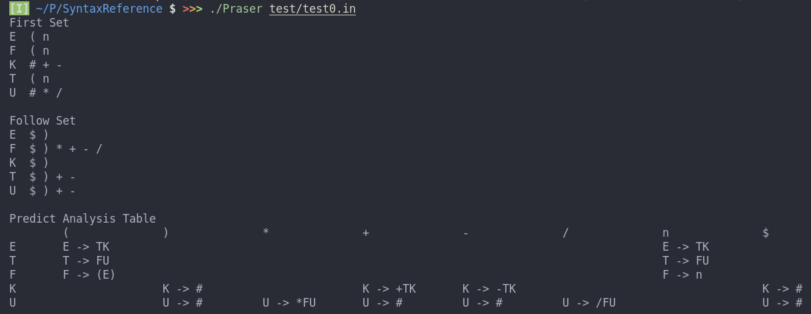
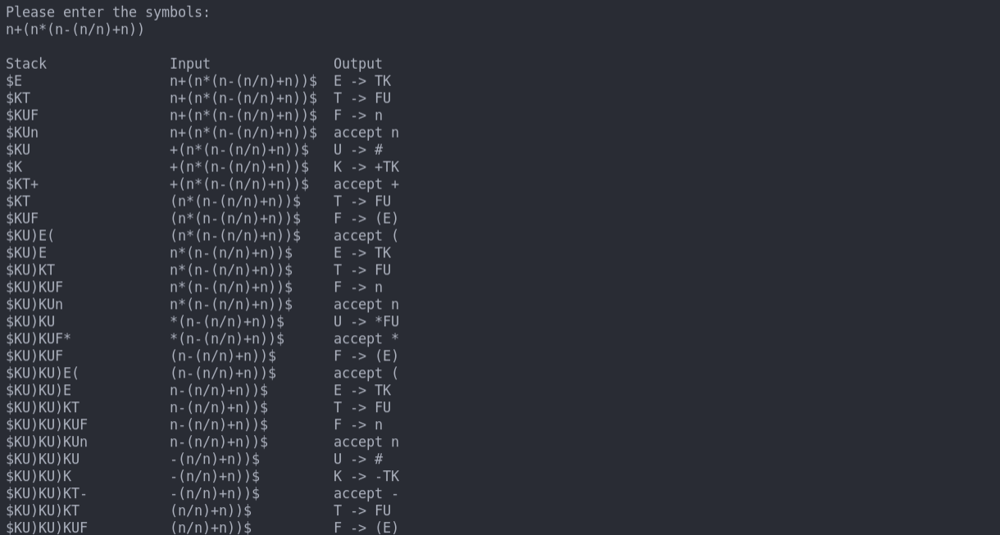
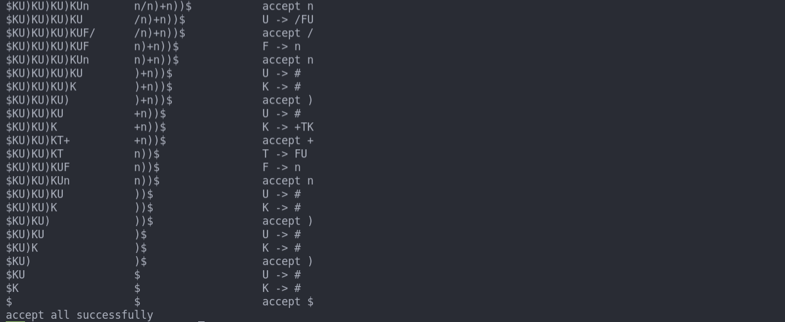

<center><font size = 10><b> 语法分析实现报告 </font></center></b>

</br>
<font size = 5>班级：2019211307 &emsp; &emsp; &emsp; &emsp;  姓名：田文阳 &emsp; &emsp; &emsp; 学号：2019211438</font>
</br>

# 1 实验内容

编写语法分析程序，计算出LL(1)文法的FIRST、FOLLOW集，然后构造预测分析表，最后根据该表进行非递归预测分析，输出结果

# 2 开发环境

操作系统: Linux Ubuntu 20.04.3 LTS </br>
IDE: Visual Studio Code 1.61.2 </br>
编译器: gcc 9.3.0 </br>

# 3 设计思路

针对LL(1)文法的非递归预测分析首先就是计算FIRST集和FOLLOW集，然后构造预测分析表，具体的算法在书上都已经有伪代码实现或文字描述，我们只需要将其以代码形式表示出来即可。

```flow
start=>start:Lexer
first=>operation: caculateFirstSet
follow=>operation: caculateFollowSet
predictTable=>operation: getPredictTable
predictAnalysis=>operation: predictAnalysis

start->first->follow->predictTable->predictAnalysis
```

# 4 代码实现

## 4.1 数据结构

```cpp
    char start; // 文法开始符号
    std::set<char> terminal, nonterminal; // 终结符与非终结符
    // first集, follow集, 构造follow集的准备
    std::unordered_map<char, std::set<char>> first, follow, preFollow; 
    std::unordered_map<char, std::vector<std::string>> grammar; // 文法
    std::vector<std::vector<std::string>> predictTable; // 预测分析表
    std::unordered_map<char, int> symbol; // 符号与数字相对应, 便于输出
```
说明：为了处理符号的方便起见，程序设定所有终结符与非终结符都以`char`类型存储，而对于`num`、`id`等处理是经由词法分析器来完成，所以完全可以设定为一个`char`型变量来表示

## 4.2 函数实现

```cpp
class Praser
{
public:
    void readFromFile(const std::string &fileName); // 从文件中获取文法
    void caculateFirstSet(); // 计算FIRST集
    void caculaleFollowSet(); // 计算FOLLOW集
    void generatePredictTable(); // 构造预测分析表
    void predictAnalysis(const std::string &input); // 进行预测分析

private:
    void getFirstSet(const char non); // 得到指定非终结符的FIRST集
    void getFollowSet(const char non); // 得到指定非终结符的FOLLOW集
    // 对字符串进行切片, 便于从指定位置开始输出
    inline std::string cutStr(const std::string &str, int pos); 

private:
    // 数据结构如上述所示
};
```

## 4.3 main函数实现

```cpp
int main(int argc, char *argv[])
{
    if (argc != 2)
        std::runtime_error("Error: Need 2 parameters\n");
    Praser praser;
    praser.readFromFile(argv[1]);
    praser.caculateFirstSet();
    praser.caculaleFollowSet();
    praser.generatePredictTable();

    std::string input;
    std::cout << "Please enter the symbols:" << std::endl;
    std::cin >> input;
    praser.predictAnalysis(input);

    return 0;
}
```

# 测试

## 测试说明

本实验所需输入为文法产生式，以及所要分析的符号串，其中$\varepsilon$以符号`#`来代替，输出为FIRST集、FOLLOW集，预测分析表，以及分析过程中栈、输入和输出

Linux环境下：输入`./Praser test/test0.in`，然后根据提示输入符号串</br>
Windows环境下：输入

## 测试样例一：书上P141给出文法

该文法在`test/test0.in`中，首先输入文件名


然后输入要分析的符号串
`n+(n*(n-(n/n)+n))`



